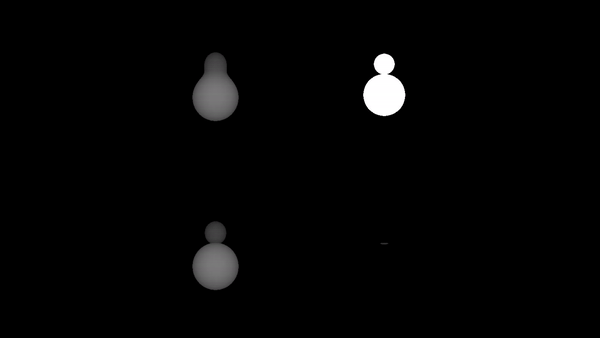

# Render-Engine

## Description (source:)
Rendering or image synthesis is the automatic process of generating a photorealistic or non-photorealistic image from a 2D or 3D
model (or models in what collectively could be called a scene file) by means of computer programs. Also, the results of displaying
such a model can be called a render. A scene file contains objects in a strictly defined language or data structure; it would contain
geometry, viewpoint, texture, lighting, and shading information as a description of the virtual scene. The data contained in the scene
file is then passed to a rendering program to be processed and output to a digital image or raster graphics image file. The term 
"rendering" may be by analogy with an "artist's rendering" of a scene.

## Approach:
Build render images by raycasting the scene from a point of view.

Each pixel of the image is a result of a singular ray projected from the point of view. If the ray does not collide with any object, 
then the pixel is black. If the ray collides with an object the color of that pixel is brighter the closer the object is from the
view point. The render engine contains 4 variations. The bottom-left is the render of the union of two objects. The top-right is a 
binary render of the scene (pixels are white if collision encountered, otherwise black), the bottom-right is the intersection of two
objects and the top-left is the union of two objects rendered with using a SmoothMin operator.

